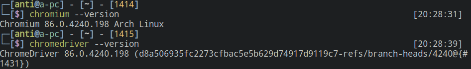
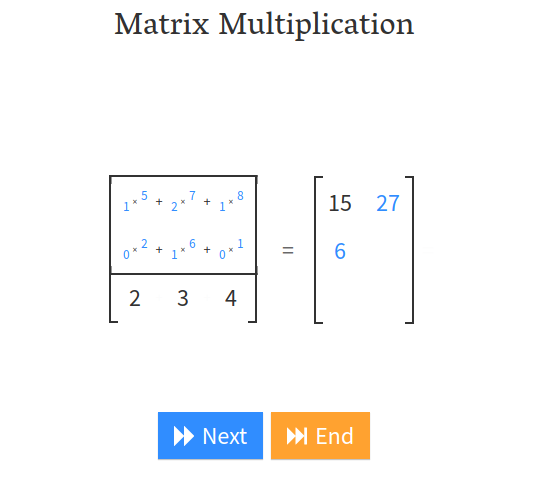
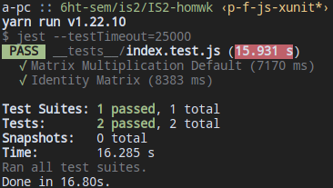

# Pruebas funcionales con Selenium

1. Entradas
2. Proceso
3. Resultado esperado

## Entradas

La entrada es la matriz default de la pagina web <link>http://matrixmultiplication.xyz/</link>

### Matriz A

| 1 | 2 | 1 |
|---|---|---|
| 0 | 1 | 0 |
| 2 | 3 | 4 |


### Matriz B

| 2 | 5 |
|---|---|
| 6 | 7 |
| 1 | 8 |


## Proceso

1. Obtencion del xpath de Matriz A
   ```javascript
    const ax = [
        [
            '//*[@id="main-container"]/div/div/div[1]/table[1]/tr[1]/td[2]/div/div[2]/div[1]/input',
            '//*[@id="main-container"]/div/div/div[1]/table[1]/tr[1]/td[2]/div/div[2]/div[2]/input',
            '//*[@id="main-container"]/div/div/div[1]/table[1]/tr[1]/td[2]/div/div[2]/div[3]/input',
        ],
        [
            '//*[@id="main-container"]/div/div/div[1]/table[1]/tr[1]/td[2]/div/div[3]/div[1]/input',
            '//*[@id="main-container"]/div/div/div[1]/table[1]/tr[1]/td[2]/div/div[3]/div[2]/input',
            '//*[@id="main-container"]/div/div/div[1]/table[1]/tr[1]/td[2]/div/div[3]/div[3]/input',
        ],
        [
            '//*[@id="main-container"]/div/div/div[1]/table[1]/tr[1]/td[2]/div/div[4]/div[1]/input',
            '//*[@id="main-container"]/div/div/div[1]/table[1]/tr[1]/td[2]/div/div[4]/div[2]/input',
            '//*[@id="main-container"]/div/div/div[1]/table[1]/tr[1]/td[2]/div/div[4]/div[3]/input',
        ],
    ]
   ```
   Obtencion del xpath de Matriz B
   ```javascript
    const bx = [
        [
            '//*[@id="main-container"]/div/div/div[1]/table[2]/tr[1]/td[1]/div/div[2]/div[1]/input',
            '//*[@id="main-container"]/div/div/div[1]/table[2]/tr[1]/td[1]/div/div[2]/div[2]/input',
        ],
        [
            '//*[@id="main-container"]/div/div/div[1]/table[2]/tr[1]/td[1]/div/div[3]/div[1]/input',
            '//*[@id="main-container"]/div/div/div[1]/table[2]/tr[1]/td[1]/div/div[3]/div[2]/input',
        ],
        [
            '//*[@id="main-container"]/div/div/div[1]/table[2]/tr[1]/td[1]/div/div[4]/div[1]/input',
            '//*[@id="main-container"]/div/div/div[1]/table[2]/tr[1]/td[1]/div/div[4]/div[2]/input',
        ],
    ];
   ```
   Obtencion del xpath del resultado
   ```javascript
    const rx = [
        [
            '//*[@id="main-container"]/div/div/div[1]/div/div/div[2]/div[1]/span',
            '//*[@id="main-container"]/div/div/div[1]/div/div/div[2]/div[2]/span',
        ],
        [
            '//*[@id="main-container"]/div/div/div[1]/div/div/div[3]/div[1]/span',
            '//*[@id="main-container"]/div/div/div[1]/div/div/div[3]/div[2]/span',
        ],
        [
            '//*[@id="main-container"]/div/div/div[1]/div/div/div[4]/div[1]/span',
            '//*[@id="main-container"]/div/div/div[1]/div/div/div[4]/div[2]/span',
        ],
    ];
   ```
2. En lugar de utilizar GeckoDriver se utiliza ChromeDriver:
<!--  -->
<div style="text:align:center"></div>

3. Obtencion del texto o value del xpath especificado para la matriz:
    ```js
    const getValueByXpath = async (xpath, driver) => {
    return driver.findElement({ xpath: xpath }).getAttribute('value');
    };

    const getTextByXpath = async (xpath, driver) => {
    return driver.findElement({ xpath: xpath }).getText();
    };

    const fillMatrices = async (mx, driver, isResult = false) => {
    let m = [];
    for (let i = 0; i < mx.length; i++) {
        for (let j = 0; j < mx[i].length; j++) {
        m[i * mx[i].length + j] = isResult
            ? getTextByXpath(mx[i][j], driver)
            : getValueByXpath(mx[i][j], driver);
        }
    }
    return Promise.all(m).then(values => values.map(value => Number(value)));
    };
    ```

4. Inicializar:
   ```js
   let driver = new Builder().forBrowser('chrome').build();
   await driver.get('http://matrixmultiplication.xyz/');
   ```

5. Obtener valores de la matriz utilizando los anteriores xpath
    ```js
    const data = await Promise.all([
        fillMatrices(ax.mx, driver),
        fillMatrices(bx.mx, driver),
    ]);
    r.ma = data[0];
    r.mb = data[1];
    ```

6. Luego presionar el boton de Multiplicar y esperar
    ```js
    const multiplyBtn = await driver.findElement({className: 'multiply flk4j4b'});
    // Hacer click cuando encuentre el boton
    await multiplyBtn.click();
    const endBtn = await driver.wait(
        until.elementLocated({ className: 'end fljzbrb' })
    );
    await endBtn.click();
    // Esperar la animacion de la multiplicacion
    const resetBtn = await driver.wait(
        until.elementLocated({ className: 'reset flk4j4b' })
    );
    // Llenar matriz con el resultado
    r.mr = await fillMatrices(rx.mx, driver, (isResult = true));
    ```
    <div style="text-align:center"></div>
## Resultado esperado

Comparar el resultado con un algoritmo de multiplicacion de matrices.

```js
const mxprod = (a, b, ax, bx) => {
  let r = [];
  for (let i = 0; i < ax.r; i++) {
    for (let j = 0; j < bx.c; j++) {
      r[i * bx.c + j] = 0;
      for (let k = 0; k < ax.c; k++) {
        let ea = a[i * ax.c + k];
        let eb = b[k * bx.c + j];
        r[i * bx.c + j] += ea * eb;
      }
    }
  }
  return r;
};
```

Comparacion usando xunit, haciendo uso de la libreria jest.
```js
const { result, mmult } = require('../setup');
const { ax, bx } = require('../matrices');

test('Matrix Multiplication', async () => {
  // assertion
  const r = await result;
  expect(r.mr).toEqual(mmult(r.ma, r.mb, ax, bx));
});
```
<dib style="text:center"></div>